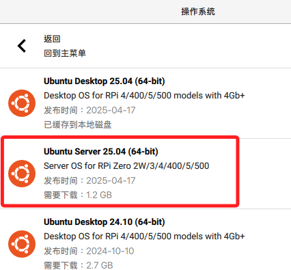
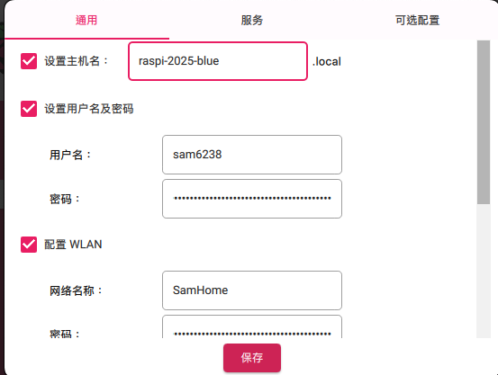

# Ubuntu 系統

_以下簡單介紹 Ubuntu 系統的燒錄以及使用_

<br>

## 燒錄

1. 同樣使用官方燒錄工具 `Imager`，選擇 `Unbuntu Server`。

    

<br>

2. 其餘配置與燒錄樹莓派系統時相同，包含主機名稱、開啟 SSH 服務等，不贅述。

    

<br>

## 觀察

1. 完成後先不用拔除卡片，透過終端機可查看當前卡片內容，通常已掛載為 `/Volumes/system-boot`。

    ```bash
    ls /Volumes/system-boot
    ```

<br>

2. 在 MacOS 系統中，若要在終端機內進行安全退出磁碟，可使用以下指令。

    ```bash
    diskutil unmount /Volumes/system-boot
    ```

<br>

## 補充說明掛載

_一般來說，SD 卡會分為兩個分割區_

<br>

1. `system-boot`，FAT32 格式；這個分割區內容包括開機所需的 bootloader、kernel 與 `grub.cfg`、`cmdline.txt`，也包含可編輯的 `user-data`、`network-config` 等 cloud-init 設定檔。

<br>

2. 另外還有一個 `root filesystem` 分割區，通常是 ext4 格式；在 macOS 上不會自動掛載這個分區，因為 macOS 無法原生讀寫 ext4 檔案系統，通常掛載點為 `/root`，內容包含 Linux 系統的主體，例如 `/etc`, `/home`, `/var`, `/usr` 等。

<br>

3. 若是 Ubuntu Desktop 版的開機分割區通常是用 UEFI 格式建立 `/boot/efi`，且根分割區 `ext4` 亦無法被 macOS 掛載，因此在 Desktop 版下也只能在 macOS 上看到 FAT32 的 boot 分割區。

<br>

## 第一次開機

_接上外接顯示器、鍵盤滑鼠，並將燒錄好的卡插入後開機_

<br>

1. 等待畫面出現 `Finished apt-news.service - Update APT News.`，從本機終端機運行 SSH 連接。

    ```bash
    ssh <帳號>@<IP-或主機名稱>
    ```

<br>

2. 查看當前連線帳號。

    ```bash
    whoami
    ```

<br>

3. 查詢當前設備分配到的 IP。

    ```bash
    hostname -I
    ```

<br>

___

_END_